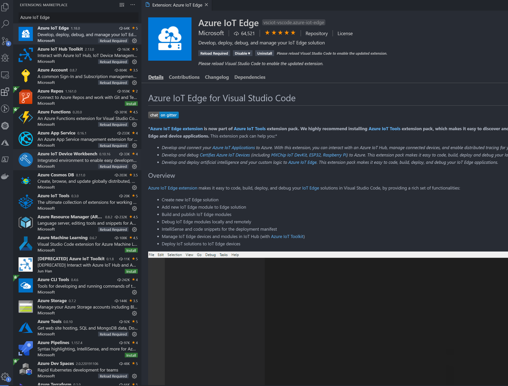
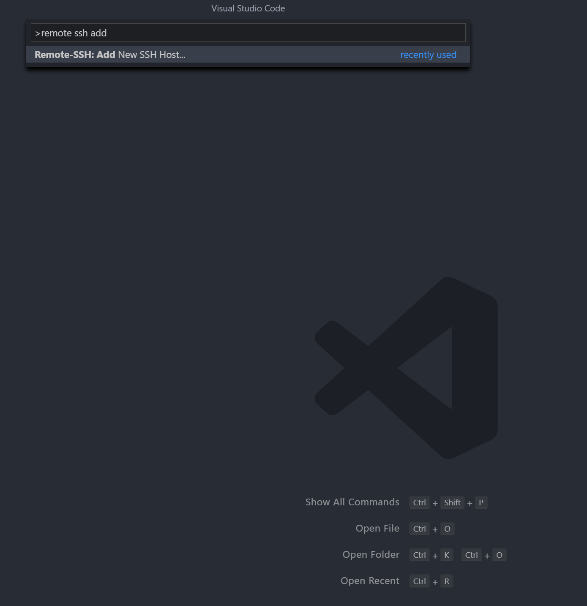
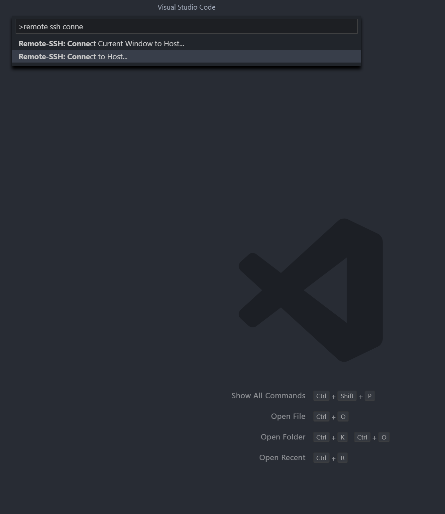

# Setting Up VS Code for IoT Edge Development Hints #
This is not a step-by-step guide. Instead it's a collection of screenshots which will help you complete the required steps.
This is on purpose: We want you to explore and try out different options.

## Install "Azure IoT Edge" Extension in VS Code


## Configure Remote SSH extension to acces the remote VM
In a nutshell you will need to add an entry to your SSH config file that will look like this:

```
Host <SOME NAME YOU WILL REMEMBER>
    HostName <IP ADDRESS OF YOUR AZURE VM>
    User <YOUR VM USERNAME>
```

On Windows this file is typically located under *C:\Users\<USERNAME>\.ssh\config*

Unless you used an SSH-Key for VM authentication you will be prompted for your password.

To add a new SSH-Host via VS Code:


To connect to remote host via SSH:


To get more details please refer to *[this guide](https://code.visualstudio.com/blogs/2019/07/25/remote-ssh)* 
